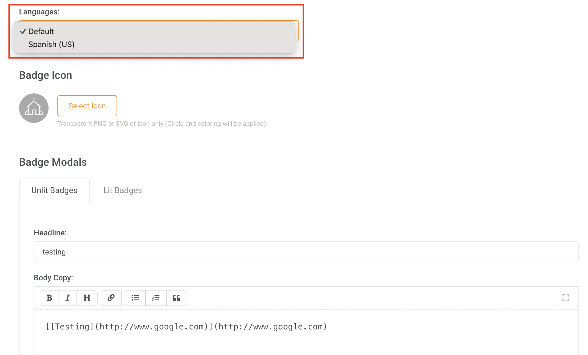

# Translated Languages Support in API Endpoints

## Definition
A few endpoints support the `Accept-Language` HTTP header when returning information based on the configured Languages for your organization to return translations for their content. Every endpoint that supports this header will have a specific note on it. 

Available languages were set up during onboarding. If these need to be modified, please file a support request.

## Implementation Notes
No translations are automatically generated; all are based on content that has been entered manually in the MES in the relevant editor fields. For example, badges must have content entered for a specific language as shown below:

The format for this header is as described [on the relevant MDN page](https://developer.mozilla.org/en-US/docs/Web/HTTP/Headers/Accept-Language)

In the scenario shown on the image, the header `Accept-Language: es-US` would return the Spanish content for this badge.

When a language is requested, the system will attempt to return whatever has been specified for that translation and that specific state. It follows that for a badge to be fully translated to both English and Spanish requires creating 4 representations of its content: an unlit English version, a lit English version, an unlit Spanish version, and a lit Spanish version.

**Even if a specific language is enabled for your organization, when no matching representation exists, the representation for your organization's default language will be returned.** Content is always returned and does not fail nor return partial responses based on the header's content.

## Limitations
Due to the above, the returned language does NOT necessarily match what is returned in the `Content-Language` response header or `Accept-Language` request header. A `406` error code is not returned for unknown or missing translation languages.